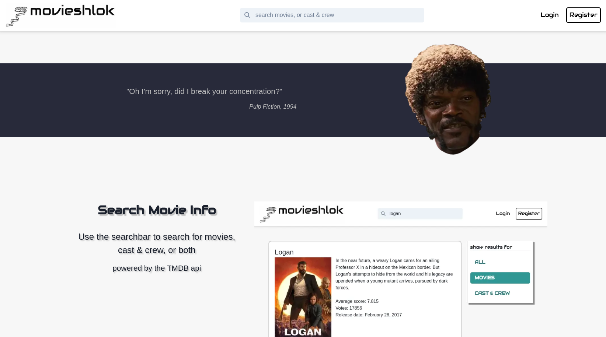

# Movieshlok

# mvplaylist

Movieshlok is a website dedicated to cinema of all kinds, from kino to schlock, and everything \
in between. It let's users search for and view details about movies and cast & crew members \
using the TMDB api. They can create accounts and leave reviews of movies, or just read and \
comment on reviews left by other users. They can view a list of all their own or another users' \
reviews. They can like and rate movies on a 5 star rating scale. They can also add movies to \
their watch list and view all movies on their own or other users' watch lists.

Languages: Typescript, HTML, CSS, Rust, SQL

Libraries and Frameworks: Next, React, Redux Toolkit, ChakraUI, Warp, Diesel, Jwt, Bcrypt

Tools and Technology: PostgreSQL, Docker, Postman, DigitalOcean

Apis: TMDB api
